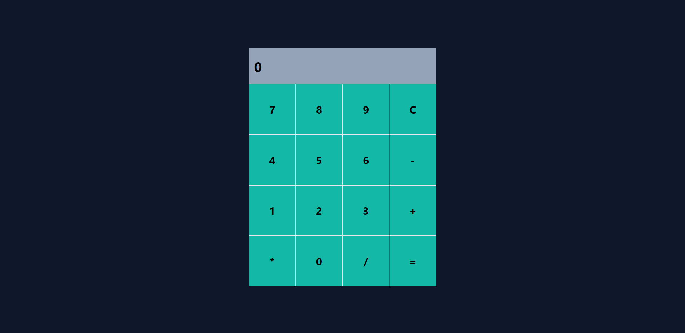

<p align="center">
  <a href="#project">Project</a>&nbsp;&nbsp;&nbsp;|&nbsp;&nbsp;&nbsp;
  <a href="#-technologies">Technologies</a>&nbsp;&nbsp;&nbsp;|&nbsp;&nbsp;&nbsp;
  <a href="#-Getting started">Getting started</a>&nbsp;&nbsp;&nbsp;|&nbsp;&nbsp;&nbsp;
  <a href="#-Image">Screenshot</a>&nbsp;&nbsp;&nbsp;|&nbsp;&nbsp;&nbsp;
</p>

<br>

---
<h1 align="center">
    
</h1>

---
## 💻 Project

Projeto pratico para a Formação React Developer da dio.me:
Objetivo: Criar uma calculadora funcional com objetivo de manipular estados no ReactJS

## 🧪 Technologies

This project was developed using the following technologies:
 
- [ReactJS](https://react.dev/)
- [Vite](https://vitejs.dev/)
- [Tailwind](https://tailwindcss.com/)

## 🚀 Getting started

Clone the project and access the folder.

```bash
$ git clone https://github.com/MaykonRaphael/desafio-calculadora.git
$ cd desafio-calculadora
```

Instal all dependencies
```bash
$ npm i
```

Start the project
```bash
$ npm run dev
```